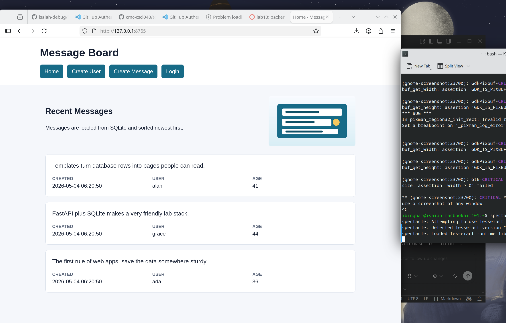

# Message Board FastAPI App

This repository contains a small FastAPI lab app that displays messages from a SQLite database. It includes templates, static CSS, a static image, and the five required routes from the assignment.

## Routes

- `/`
- `/login`
- `/logout`
- `/create_message`
- `/create_user`

## Run Locally

```bash
python3 db_create.py
uvicorn main:app --reload
```

Open <http://127.0.0.1:8000> in your browser.

## Test

```bash
pytest
```

## Screenshot

The `/` route displays messages from SQLite with the message text, creation timestamp, username, and user age.



## Submission Note

Submit the GitHub link to the `lab-submission` branch on Canvas. After submitting, do not update that branch; continue future work on `main`.
